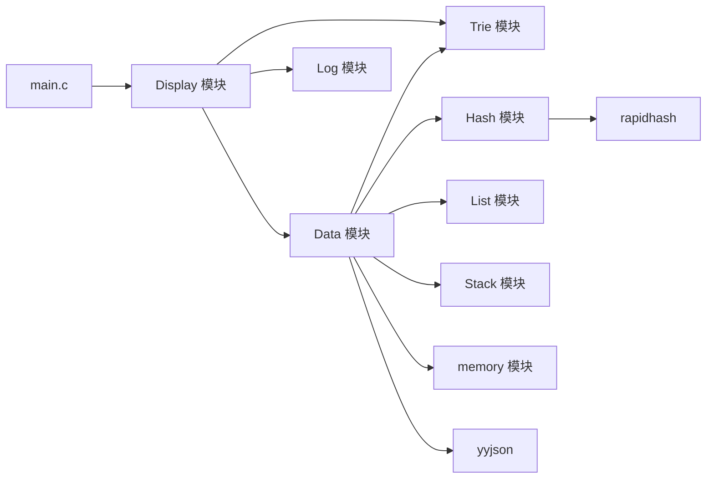
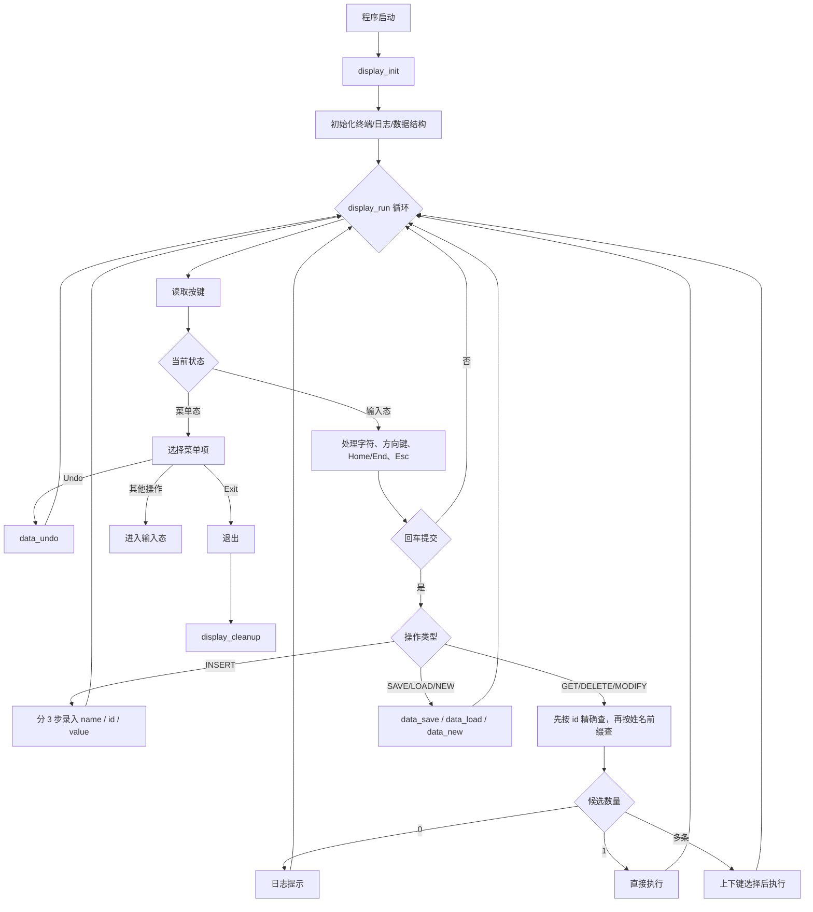

# 学生信息管理系统

一个基于 C 语言实现的终端学生信息管理系统。项目围绕双向链表组织哈希表、前缀树和操作栈，实现高效 CRUD、姓名前缀检索、撤销操作和 JSON 持久化。

## 核心特性

- 哈希表按 `id` 提供平均 `O(1)` 的查询、插入、删除
- 双向链表保留插入顺序，便于遍历、保存和验证顺序
- 前缀树按 UTF-8 字节建立 256 子指针表，适合处理同前缀、同名、多候选场景
- 单链表栈记录用户操作，支持撤销插入、删除、修改
- 简化后的单屏 TUI，统一处理菜单、输入、结果区和日志区
- 菜单支持循环导航，最后一项继续向下会回到开头，第一项继续向上会回到末尾
- 数据层通过 `DataStatus` 返回状态码，显示层统一负责提示文案
- 提供非 TUI smoke test，覆盖核心数据结构和文件回环

## 数据结构设计

课程作业目标：围绕链表组织多个数据结构。

1. 双向链表 + 哈希表组合实现 CRUD
2. 哈希桶使用单向链表解决冲突
3. 操作历史栈使用单向链表实现
4. 姓名索引使用 256 分支前缀树实现，按 UTF-8 字节逐层索引

## 当前架构

### 数据层

- `Data.c/.h`：核心业务层，维护状态码、文件脏标记、撤销逻辑和 JSON 读写
- `Hash.c/.h`：按 `id` 建立哈希索引
- `List.c/.h`：维护全量记录链表和保存顺序
- `Trie.c/.h`：按姓名建立前缀索引
- `Stack.c/.h`：记录可撤销操作

### 表示层

- `Display.c/.h`：控制层、输入层、渲染层合并在一个文件里，负责菜单流转、输入编辑、搜索候选和结果展示
- `Log.c/.h`：ring buffer 日志区，供 TUI 底部滚动显示

## 模块图



## 运行流程



## 构建与运行

### 方式一：使用 Makefile

```bash
make
make run
make smoke-test
make run-smoke
make clean
```

### 方式二：直接使用 gcc

```bash
gcc -Wall -Wextra -Werror -std=c23 -O3 -o student_system.exe main.c Display.c Data.c Hash.c List.c Log.c Stack.c Trie.c memory.c yyjson.c
gcc -Wall -Wextra -Werror -std=c23 -O3 -o core_smoke_test.exe core_smoke_test.c Data.c Hash.c List.c Log.c Stack.c Trie.c memory.c yyjson.c
./student_system.exe
./core_smoke_test.exe
```

当前这台 Windows PowerShell 环境里缺少 `make`，直接使用 `gcc` 最稳。

## 测试数据

仓库自带 `test.json`，适合直接加载验证程序特色：

- 同前缀姓名：`陈晨 / 陈辰 / 陈澄 / 陈程 / 陈晨曦`
- 英文前缀：`Alice / Alicia / Alina`
- 同名不同 ID：`王伟`
- 英文+数字混合 ID：如 `CS26A01`、`SE24C21`

建议在程序里测试这些输入：

- `陈`
- `陈晨`
- `Ali`
- `张三`
- `王伟`
- `CS26A01`

## Smoke Test 覆盖范围

`core_smoke_test.c` 当前覆盖：

- 哈希查询与重复 ID 拦截
- 链表头尾顺序
- Trie 前缀检索
- 修改、删除、撤销
- 保存、加载、脏数据保护
- 非法文件格式拦截
- 长姓名删除与撤销，验证 Trie 删除路径安全性

## Third-Party Dependencies

| Name | Purpose | Version | Upstream | License |
|---|---|---|---|---|
| yyjson | JSON 解析与序列化 | 0.12.0 | https://github.com/ibireme/yyjson | MIT |
| rapidhash | 高性能哈希算法 | V3 | https://github.com/Nicoshev/rapidhash | MIT |

### License Notice

- `yyjson` 和 `rapidhash` 的版权与许可证归其原作者所有
- 本项目用于课程学习与实验，遵循上游许可证要求
- 发布或分发时请保留上游 `LICENSE` 声明并标注第三方来源
