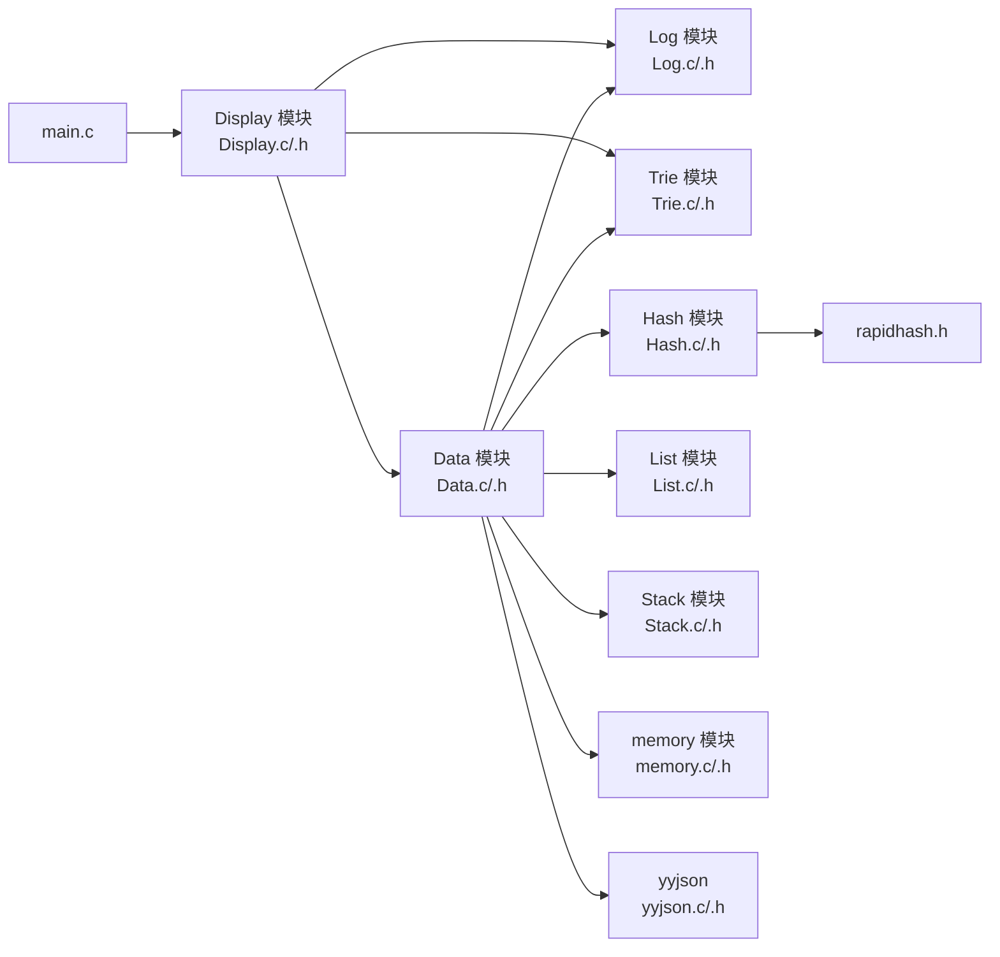
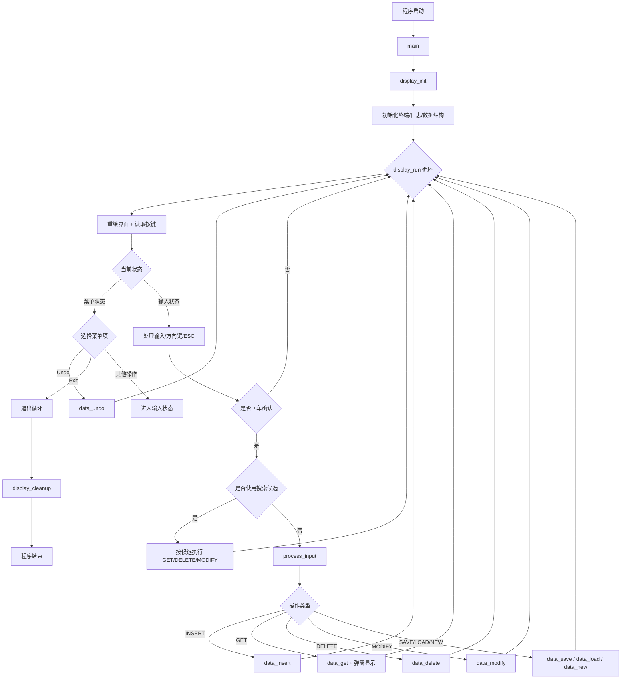

# 学生信息管理系统

一个基于 C 语言实现的终端学生信息管理系统，使用双向链表、哈希表、前缀树和操作栈实现高效 CRUD、前缀检索和撤销操作，并使用 JSON 文件进行持久化。

## 核心特性

- 平均 O(1) 的 ID 查询、插入、删除（哈希表）
- 保留插入顺序的双向链表存储（便于遍历与保存）
- 基于姓名前缀的快速搜索（Trie）
- 支持撤销最近一次操作（单链表栈）
- TUI 交互界面，支持方向键与多步骤输入

## 数据结构设计

课程作业目标：围绕链表组织多个数据结构。

1. 双向链表 + 哈希表组合实现 CRUD
2. 哈希桶使用单向链表解决冲突
3. 操作历史栈使用单向链表实现
4. 已访问节点集合使用单向链表实现
5. 姓名索引使用多叉链表（前缀树）实现

## 模块图



## 程序流程图



## 构建与运行

```bash
make
make run
make clean
```

## Third-Party Dependencies

本项目使用了以下第三方开源组件：

| Name | Purpose | Version | Upstream | License |
|---|---|---|---|---|
| yyjson | JSON 解析与序列化 | 0.12.0 | https://github.com/ibireme/yyjson | MIT |
| rapidhash | 高性能哈希算法 | V3 | https://github.com/Nicoshev/rapidhash | MIT |

### License Notice

- `yyjson` 和 `rapidhash` 的版权与许可证归其原作者所有。
- 本项目仅用于课程学习与实验，遵循各上游项目许可证要求。
- 如需发布或分发，请保留上游 `LICENSE` 声明并在发布说明中标注第三方来源。

## TODO

- [ ] 预测最想访问（计划尝试 ARC 类思路）
