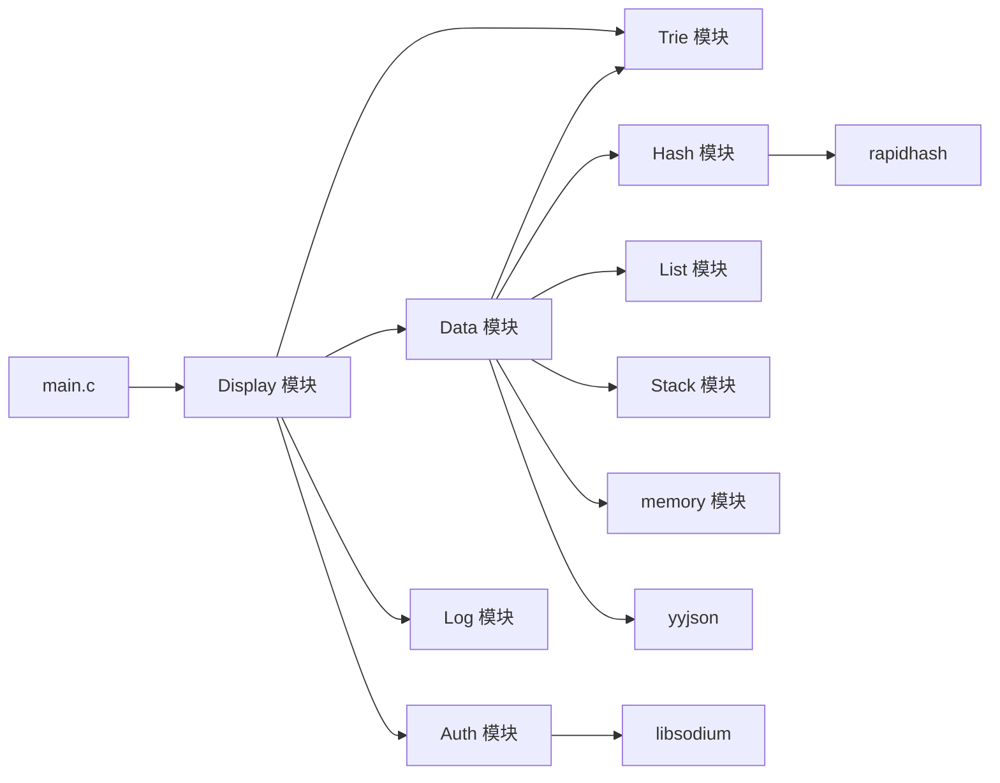

# 学生信息管理系统

一个基于 C 语言实现的终端学生信息管理系统。项目围绕双向链表组织哈希表、前缀树和操作栈，实现高效 CRUD、姓名前缀检索、撤销操作，以及基于 `Argon2id + XChaCha20-Poly1305` 的加密存档。

## 核心特性

- 哈希表按 `id` 提供平均 `O(1)` 的查询、插入、删除
- 双向链表保留插入顺序，便于遍历、导出和顺序验证
- 前缀树按 UTF-8 字节建立 256 子指针表，适合处理中英文前缀搜索
- 单链表栈记录用户操作，支持撤销插入、删除、修改
- `Display` 模块负责文件名和密码输入，密码框使用 `*` 掩码显示
- `Auth` 模块统一负责 Argon2id 派生、文件头生成、flag 校验、XChaCha20-Poly1305 加解密和文件读写
- `Data` 模块专注链表和 JSON 明文处理，继续维护脏标记、回滚导入和撤销逻辑
- 提供非 TUI smoke test，覆盖核心数据结构、加密回环、密码错误和密文篡改场景

## 数据结构设计

课程作业目标：围绕链表组织多个数据结构。

1. 双向链表 + 哈希表组合实现 CRUD
2. 哈希桶使用单向链表解决冲突
3. 操作历史栈使用单向链表实现
4. 姓名索引使用 256 分支前缀树实现，按 UTF-8 字节逐层索引

## 当前架构

### 数据层

- `Data.c/.h`：核心业务层，维护状态码、脏标记、撤销逻辑，以及明文 JSON 的导入导出
- `Hash.c/.h`：按 `id` 建立哈希索引
- `List.c/.h`：维护全量记录链表和保存顺序
- `Trie.c/.h`：按姓名建立前缀索引
- `Stack.c/.h`：记录可撤销操作

### 加密层

- `Auth.c/.h`：统一处理 `libsodium` 初始化、Argon2id 密钥派生、文件头读写、flag 校验、XChaCha20-Poly1305 加解密和缓冲区清零

### 表示层

- `Display.c/.h`：控制层、输入层、渲染层合并在一个文件里，负责菜单流转、输入编辑、搜索候选、文件名/密码两步输入和结果展示
- `Log.c/.h`：ring buffer 日志区，供 TUI 底部滚动显示

## 模块图



## 文件存档格式

加密存档使用二进制 `.dat` 文件，文件头固定包含以下字段：

- `magic = "SSDBENC1"`
- `version = 1`
- `salt[16]`
- `flag_nonce[24]`
- `payload_nonce[24]`
- `flag_size`，小端 64 位整数
- `payload_size`，小端 64 位整数

加密流程：

1. `Display` 读取用户输入的明文密码
2. `Auth` 使用 `Argon2id` 和随机 `salt` 派生 32 字节密钥
3. `Auth` 先用该密钥加密固定 `flag`
4. `Auth` 再用同一把密钥加密 `Data` 导出的 JSON 明文
5. 加载时先解密 `flag`，校验通过后再解密真正 payload

固定 `flag` 明文为 `STUDENT_SYSTEM_AUTH_V1`。密码错误时，加载流程停留在密码步骤并提示重新输入。

## 运行流程

```mermaid
flowchart TD
	A[程序启动] --> B[display_init]
	B --> C[初始化终端/日志/数据结构]
	C --> D{display_run 循环}

	D --> E[读取按键]
	E --> F{当前状态}

	F -->|菜单态| G[选择菜单项]
	G -->|Undo| G1[data_undo]
	G -->|Exit| Z[退出]
	G -->|其他操作| H[进入输入态]

	F -->|输入态| I[处理字符、方向键、Home/End、Esc]
	I --> J{回车提交}
	J -->|否| D
	J -->|是| K{操作类型}

	K -->|INSERT| K1[分 3 步录入 name / id / value]
	K -->|GET/DELETE/MODIFY| K2[先按 id 精确查，再按姓名前缀查]
	K -->|SAVE/LOAD/NEW| K3[文件名 -> 密码 -> Data 与 Auth 组合执行]

	K3 -->|SAVE| K31[data_export_json -> auth_save_file]
	K3 -->|LOAD| K32[auth_load_file -> data_import_json]
	K3 -->|NEW| K33[auth_save_file("[]") -> data_init]

	K2 --> L{候选数量}
	L -->|0| L1[日志提示]
	L -->|1| L2[直接执行]
	L -->|多条| L3[上下键选择后执行]

	G1 --> D
	K1 --> D
	K31 --> D
	K32 --> D
	K33 --> D
	L1 --> D
	L2 --> D
	L3 --> D
	Z --> P[display_cleanup]
```

## 构建与运行

### 依赖

- `mingw-w64-ucrt-x86_64-gcc`
- `mingw32-make`
- `pkg-config`
- `mingw-w64-ucrt-x86_64-libsodium`

### 使用 Makefile

```bash
mingw32-make
mingw32-make run
mingw32-make smoke-test
mingw32-make run-smoke
mingw32-make clean
```

Makefile 会通过 `pkg-config --cflags --libs libsodium` 自动注入 `libsodium` 的编译和链接参数。

## 测试数据

仓库自带 `test.dat`，演示密码是 `demo123`。适合直接加载验证程序特色：

- 同前缀姓名：`陈晨 / 陈辰 / 陈澄 / 陈程 / 陈晨曦`
- 英文前缀：`Alice / Alicia / Alina`
- 同名不同 ID：`王伟`
- 英文+数字混合 ID：如 `CS26A01`、`SE24C21`

建议在程序里测试这些输入：

- `陈`
- `陈晨`
- `Ali`
- `张三`
- `王伟`
- `CS26A01`

## Smoke Test 覆盖范围

`core_smoke_test.c` 当前覆盖：

- 哈希查询与重复 ID 拦截
- 链表头尾顺序
- Trie 前缀检索
- 修改、删除、撤销
- 加密保存、解密加载、脏数据保护
- 错误密码拦截
- 非法文件头、flag 篡改、payload 篡改
- 空加密文件新建与加载
- 长姓名删除与撤销，验证 Trie 删除路径安全性

## Third-Party Dependencies

| Name | Purpose | Version | Upstream | License |
|---|---|---|---|---|
| libsodium | Argon2id、XChaCha20-Poly1305、随机数与安全清零 | current package | https://libsodium.org | ISC |
| yyjson | JSON 解析与序列化 | 0.12.0 | https://github.com/ibireme/yyjson | MIT |
| rapidhash | 高性能哈希算法 | V3 | https://github.com/Nicoshev/rapidhash | MIT |

### License Notice

- `libsodium`、`yyjson` 和 `rapidhash` 的版权与许可证归其原作者所有
- 本项目用于课程学习与实验，遵循上游许可证要求
- 发布或分发时请保留上游 `LICENSE` 声明并标注第三方来源
